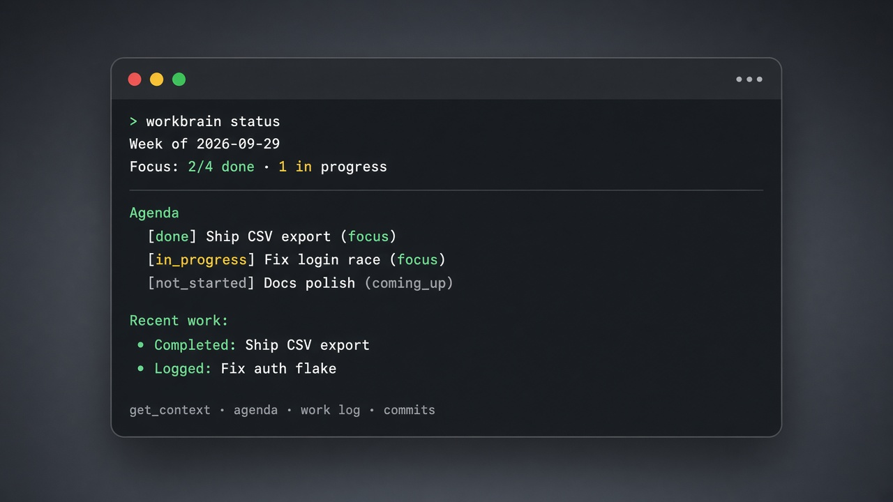

# Workbrain

**Your personal operating layer for AI-assisted work.**

<p align="center">
  
</p>

Workbrain is a local [Model Context Protocol (MCP)](https://modelcontextprotocol.io) server for [Claude Code](https://code.claude.com). It gives Claude persistent context about how you work, what you're focused on this week, and what you've shipped — without sending that data to the cloud or sharing it with your team.

---

## Overview

Most AI coding setups tell the model *how to behave* (rules, prompts). Workbrain tells it *what you're doing* — and lets it keep that picture up to date as you work.

| Layer | What it stores | Example |
|-------|----------------|---------|
| **Playbook** | How you work | Bug-fix approach, communication style |
| **Agenda** | What you're focused on | This week's priorities and deliverables |
| **Work log** | What you shipped | Summaries linked to agenda items |
| **Commits** | Raw git activity | Auto-captured via optional hook |

Everything lives on your machine in `~/.workbrain/`. Nothing is committed to project repos unless you choose to.

---

## Features

- **Unified context** — `get_context` returns playbook, agenda, work log, and commits in a single call
- **Living weekly board** — Claude can add, update, and complete agenda items during a session
- **Automatic work logging** — marking an agenda item done creates a linked work log entry
- **Local-first & private** — SQLite + markdown on disk; no accounts, no cloud sync required
- **Cross-project** — registered at user scope; follows you across every repo
- **Git integration** — optional post-commit hook records commits automatically
- **CLI** — check your week from the terminal without opening Claude

---

## Requirements

- **Node.js 22+** (uses built-in `node:sqlite` — no native dependencies)
- **Claude Code** CLI or extension (Cursor, VS Code, or terminal)

---

## Quick start

```bash
git clone https://github.com/himanshu-sharma-55/work-brain.git
cd work-brain
npm install
node bin/install.js
```

Register the MCP server (server name is `workbrain`; repo folder is `work-brain`):

```bash
claude mcp add --scope user workbrain -- node /absolute/path/to/work-brain/src/index.js
```

Set `WORKBRAIN_ROOT` once per machine:

```bash
# macOS / Linux — add to ~/.zshrc or ~/.bashrc
export WORKBRAIN_ROOT=/absolute/path/to/work-brain
```

```powershell
# Windows PowerShell (persists for new terminals)
setx WORKBRAIN_ROOT "C:\path\to\work-brain"
```

Verify in Claude Code: type `/mcp` and confirm **workbrain** is connected.

Edit your playbook: `~/.workbrain/playbook.md`

---

## How it works

```
┌─────────────────────────────────────────────────────────┐
│                     Claude Code                         │
│              (Cursor / VS Code / CLI)                   │
└────────────────────────┬────────────────────────────────┘
                         │ MCP (stdio)
                         ▼
┌─────────────────────────────────────────────────────────┐
│                  Workbrain Server                       │
│  get_context · get_agenda · log_work · get_commits …   │
└────────────────────────┬────────────────────────────────┘
                         │
          ┌──────────────┼──────────────┐
          ▼              ▼              ▼
   playbook.md       data.db      git hook (optional)
   (how you work)   (agenda,       (commit capture)
                     work log,
                     commits)
          └──────────────┴──────────────┘
                         │
                    ~/.workbrain/
                    (or WORKBRAIN_HOME)
```

Claude calls Workbrain tools on demand — your rules aren't loaded into every message, keeping context lean until it's needed.

---

## MCP tools

| Tool | Description |
|------|-------------|
| `get_context` | **Recommended entry point.** Playbook, current agenda, recent work log, and commits |
| `get_playbook` | Read your personal playbook |
| `update_playbook` | Replace or append to your playbook |
| `get_agenda` | Weekly board: focus, coming up, expected |
| `add_agenda_item` | Add an item to the board |
| `update_agenda_item` | Update status, title, estimate, etc. Auto-logs work when marked done |
| `delete_agenda_item` | Remove an agenda item |
| `rollover_agenda` | Move unfinished items from last week to the current week |
| `get_weekly_summary` | Agenda stats, work log, and commits for a given week |
| `get_work_log` | Recent work summaries |
| `log_work` | Log what you shipped (optionally linked to an agenda item) |
| `get_commits` | Recent commits captured by the git hook |

### Recommended session flow

Add this to your **personal** Cursor or Claude rules:

> At the start of a work session, call `get_context`. When we finish a clear task, update the agenda and log work. Marking an agenda item done is enough — it auto-logs.

### Example prompts

| You say | Workbrain does |
|---------|----------------|
| "What's my focus this week?" | Calls `get_context` |
| "Mark CSV export as in progress" | Calls `update_agenda_item` |
| "What did I ship this week?" | Calls `get_weekly_summary` |
| "Roll over unfinished items" | Calls `rollover_agenda` |
| "How do I usually fix bugs?" | Reads playbook |

---

## CLI

Check status without Claude:

```bash
node bin/workbrain.js status     # current week at a glance
node bin/workbrain.js summary    # full week recap
npm run status                   # shortcut via package script
```

---

## Configuration

### Environment variables

| Variable | Default | Description |
|----------|---------|-------------|
| `WORKBRAIN_HOME` | `~/.workbrain` | Data directory (playbook, database) |
| `WORKBRAIN_ROOT` | — | Path to the work-brain repo; required for git hooks |

### Data directory layout

```
~/.workbrain/
├── playbook.md    # How you work (markdown)
├── data.db        # Agenda, work log, commits (SQLite)
└── git-template/  # Git hook template (created by install)
```

### Custom data directory

```bash
export WORKBRAIN_HOME=/path/to/shared/workbrain-data
claude mcp add --scope user workbrain -- \
  env WORKBRAIN_HOME=/path/to/shared/workbrain-data \
  node ~/work-brain/src/index.js
```

---

## Git integration

`node bin/install.js` configures a global git template so **new repositories** automatically include the post-commit hook.

For an **existing repository**:

```bash
export WORKBRAIN_ROOT=/path/to/work-brain   # macOS/Linux shell profile
# Windows: setx WORKBRAIN_ROOT "C:\path\to\work-brain"
node /path/to/work-brain/bin/setup-git-hook.js /path/to/repo
```

Each commit records hash, repo, branch, message, and files changed into `~/.workbrain/data.db`.

### Using husky?

`setup-git-hook.js` writes to `.git/hooks/post-commit`. Repos that use [husky](https://typicode.github.io/husky/) set `core.hooksPath` to `.husky/`, so Git **ignores** `.git/hooks/` and commits will not be recorded (you'll see `0 commits` in status).

**Fix:** add (or append) this line in `.husky/post-commit`:

```sh
node "$WORKBRAIN_ROOT/hooks/record-commit.js" || true
```

Confirm with `git config core.hooksPath` — if it prints `.husky`, use the path above instead of `setup-git-hook.js`.

---

## Multi-machine setup

Clone and register on each machine:

```bash
git clone https://github.com/himanshu-sharma-55/work-brain.git ~/work-brain
cd ~/work-brain && npm install && node bin/install.js
claude mcp add --scope user workbrain -- node ~/work-brain/src/index.js
```

Each machine maintains its own `~/.workbrain/` by default. To sync data:

| Method | Approach |
|--------|----------|
| Cloud folder | Symlink `~/.workbrain` to iCloud, Dropbox, etc. |
| Dotfiles repo | Track `playbook.md`; copy `data.db` periodically |
| Shared path | Set `WORKBRAIN_HOME` to the same location on both machines |

---

## Cursor setup

Workbrain uses **Claude Code MCP**, not Cursor's `~/.cursor/mcp.json`.

1. Install the Claude Code extension in Cursor
2. Open the integrated terminal
3. Run `claude mcp add` (see [Quick start](#quick-start))
4. In the Claude panel: `/mcp` → enable **workbrain**

---

## Privacy & scope

Workbrain is designed for **individual use**:

- MCP is registered with `--scope user` — not tied to any project repo
- Personal data never leaves your machine unless you sync it yourself
- Do not commit `.mcp.json` to shared team repositories

---

## Troubleshooting

| Issue | Resolution |
|-------|------------|
| `claude` command not found | Install [Claude Code CLI](https://code.claude.com) or use the extension terminal |
| Server missing from `/mcp` | Re-run `claude mcp add --scope user workbrain -- node /path/to/work-brain/src/index.js` |
| Broken path after moving the repo | `claude mcp remove workbrain`, then re-add with the updated path |
| Commits not recording / `0 commits` | Verify `WORKBRAIN_ROOT` is set. If the repo uses husky (`git config core.hooksPath` → `.husky`), put the hook in `.husky/post-commit` — not `.git/hooks/` |
| Server won't start | Run `node src/index.js` manually; check Node version (`node -v` ≥ 22) |

---

## Development

```bash
npm install
npm start              # run MCP server (stdio)
npm run install:local  # install + init data dir + git template
npm run status         # CLI status check
```

For local development with a global CLI alias:

```bash
cd work-brain && npm link
claude mcp add --scope user workbrain -- workbrain
```

---

## Naming

| Name | Used for |
|------|----------|
| `work-brain` | GitHub repository and local clone directory |
| `workbrain` | MCP server name, npm package, data dir (`~/.workbrain`) |
| `WORKBRAIN_*` | Environment variable prefix |

---

## License

[LICENSE](LICENSE)
